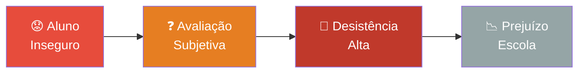
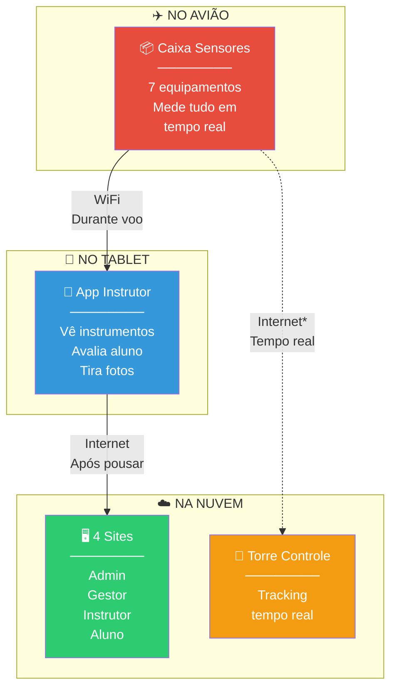
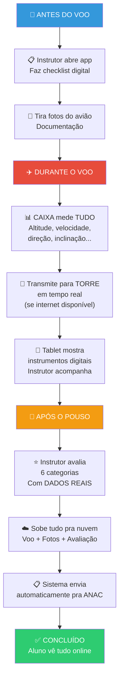
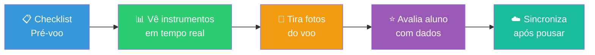
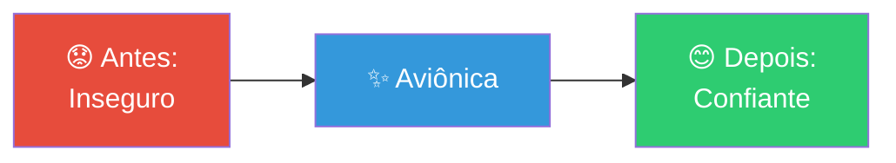
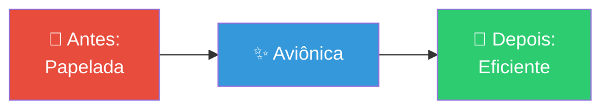
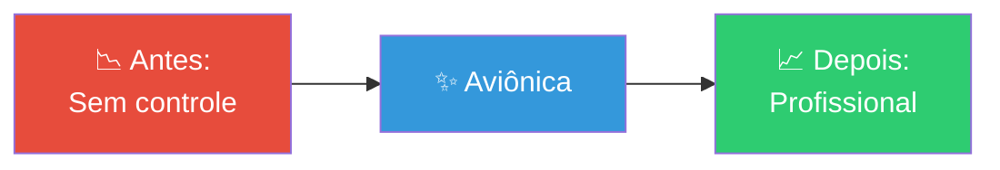
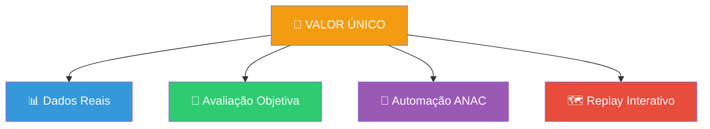
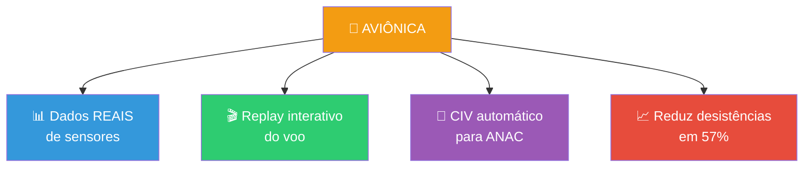
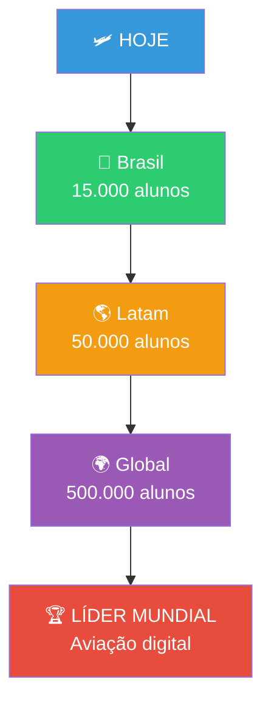

# 🛩️ QFLY/AVIÔNICA - VISÃO DE PRODUTO

**📅 Data:** Novembro 2025  
**👥 Público:** Marketing, RH, Financeiro, Investidores  
**🎯 Objetivo:** Explicar o produto sem jargões técnicos

---

## 📖 O QUE É O AVIÔNICA?

Uma plataforma completa que **transforma** a forma como as escolas de aviação ensinam e avaliam seus alunos.

Imagine que hoje, quando um aluno aprende a voar, **tudo** é baseado na **opinião do instrutor**. É como fazer prova na escola e só receber "foi bom" ou "foi ruim" — sem nota, sem dados, sem provas.

**O Aviônica muda isso completamente.**

---

## 🔴 O PROBLEMA QUE RESOLVEMOS

### Dores Atuais das Escolas de Aviação



**Principais problemas:**

1. 🤔 **"Será que estou voando bem?"**  
   → Aluno não tem certeza do próprio desempenho

2. 📝 **Avaliação 100% subjetiva**  
   → Instrutor escreve "voo satisfatório" sem dados reais

3. 🔥 **Conflitos frequentes**  
   → Aluno discorda da avaliação, não tem como provar nada

4. 📄 **Papelada manual**  
   → CIV (caderneta de voo) em papel, pode perder, rasgar, molhar

5. ⏰ **Burocracia ANAC**  
   → Enviar documentos manualmente para órgão regulador

---

## ✨ A SOLUÇÃO: 3 COMPONENTES SIMPLES

### Visão Geral do Sistema



*Transmissão para torre quando internet disponível

---

## 🎯 COMO FUNCIONA NA PRÁTICA

### Jornada Completa de um Voo



---

## 📦 COMPONENTE 1: CAIXA NO AVIÃO

**O que é?**  
Uma CAIXA eletrônica pequena (menor que uma caixa de celular) que fica no avião e **mede tudo** durante o voo.

**O que ela mede?**

| Sensor | O que faz |
|--------|-----------|
| 🗺️ GPS | Posição exata do avião |
| 📏 Altitude | Altura em relação ao solo |
| 🧭 Bússola | Direção que está indo |
| ⚡ Acelerômetro | Subidas, descidas, curvas |
| 🔄 Giroscópio | Inclinação do avião |
| 🌡️ Temperatura | Temperatura externa |

**Benefício:**  
→ **Dados REAIS** de como o aluno está voando  
→ Não é mais "achismo"

---

## 📱 COMPONENTE 2: APP NO TABLET

**O que é?**  
Um aplicativo no tablet do instrutor que funciona **mesmo sem internet** (offline).

**O que o instrutor faz no app:**



**Telas principais:**

1. **📊 Painel de Instrumentos ("Sixpack")**  
   → 6 instrumentos digitais mostrando altitude, velocidade, direção...  
   → Instrutor vê tudo em tempo real

2. **✅ Checklist Digital**  
   → Verificações antes do voo (combustível, freios, etc)  
   → Marca tudo digitalmente

3. **⭐ Avaliação do Aluno**  
   → 6 categorias baseadas no manual da ANAC  
   → Sistema sugere notas baseado nos dados reais

4. **📸 Fotos**  
   → Documenta o estado do avião  
   → Fica salvo junto com o voo

---

## 🌐 COMPONENTE 3: SITES NA INTERNET

**O que é?**  
4 sites diferentes, cada um para um tipo de pessoa:

### 1️⃣ Site do ADMINISTRADOR (Dono do Sistema)

**Quem usa:** Equipe do Aviônica  

**O que vê:**
- 📊 Todas as escolas usando o sistema
- 🗺️ Mapa global: todos os aviões voando AO VIVO
- 📈 Estatísticas gerais: quantos voos, quantas horas...
- ⚙️ Configurações do sistema

---

### 2️⃣ Site do GESTOR (Dono da Escola)

**Quem usa:** Diretor/Gerente do aeroclube  

**O que faz:**
- 👥 Cadastra alunos e instrutores
- ✈️ Cadastra aviões
- 📅 Vê agenda de voos
- 📊 Relatórios: quantas horas voadas...
- 📈 Acompanha desempenho da escola

**Benefício:**  
→ Gestão profissional da escola  
→ Decisões baseadas em dados reais

---

### 3️⃣ Site do INSTRUTOR

**Quem usa:** Instrutor de voo  

**O que vê:**
- 📋 Lista de todos os seus alunos
- 📊 Progresso de cada aluno (quantas horas fez, quais manobras domina)
- 🗺️ **Replay do voo:** ver o caminho que o avião fez no mapa
- 📈 Gráficos de performance (altitude, velocidade ao longo do tempo)
- 📄 CIV Digital já pronto para ANAC

**Diferencial único:**  
→ 🎬 **Replay Interativo:** clicar em qualquer momento do voo e ver TUDO que estava acontecendo naquele segundo

---

### 4️⃣ Site do ALUNO

**Quem usa:** Aluno aprendendo a voar  

**O que vê:**
- ✈️ Todos os meus voos
- ⭐ Minhas avaliações
- 📈 Meu progresso (falta X horas para tirar brevê)
- 📄 Minha CIV Digital (caderneta oficial)
- 📁 Meus documentos (exames médicos, certificados)

**Benefício:**  
→ Transparência total  
→ Aluno vê seu próprio desenvolvimento  
→ Reduz ansiedade e desistências

---

## 🎁 BENEFÍCIOS POR PERFIL

### Para o ALUNO



- ✅ **Transparência:** Vê dados reais do voo
- ✅ **Progresso claro:** Sabe exatamente o que falta aprender
- ✅ **Motivação:** Acompanha evolução
- ✅ **Menos conflito:** Avaliação baseada em dados, não opinião
- ✅ **Praticidade:** Tudo digital, acessa de qualquer lugar

---

### Para o INSTRUTOR



- ✅ **Menos burocracia:** Sem papel, tudo no app
- ✅ **Avaliação justa:** Dados reais apoiam a nota
- ✅ **Menos discussões:** Aluno vê os dados, aceita melhor
- ✅ **Profissionalismo:** Ferramenta moderna e séria
- ✅ **Foco no ensino:** Mais tempo para instruir, menos para papelada

---

### Para a ESCOLA (Gestor)



- ✅ **Gestão profissional:** Dados de tudo que acontece
- ✅ **Menos desistências:** Alunos satisfeitos continuam
- ✅ **Compliance ANAC:** Automático, sem risco de multa
- ✅ **Marketing:** Diferencial competitivo ("somos high-tech")
- ✅ **Crescimento sustentável:** Mais alunos completam curso e indicam amigos

---

## 🏆 DIFERENCIAIS COMPETITIVOS

### O Que Nos Torna ÚNICOS

| Concorrentes<br/>(SAGA, Alis, Plane It) | 🚀 AVIÔNICA |
|------------------------------------------|-------------|
| ❌ Só software (sem hardware) | ✅ **Hardware próprio no avião** |
| ❌ Avaliação manual/texto | ✅ **Dados reais de sensores** |
| ❌ Sem telemetria | ✅ **20x por segundo medindo tudo** |
| ❌ Sem replay | ✅ **Replay interativo no mapa** |
| ❌ Portal aluno básico | ✅ **Portal completo com progresso** |
| ❌ CIV manual | ✅ **CIV automático para ANAC** |
| ❌ Sem acompanhamento em voo | ✅ **Live tracking (GPS ao vivo)** |

### Nossa Proposta de Valor



**Resumo em uma frase:**  
> *"Somos os únicos que colocam SENSORES REAIS no avião para avaliar o aluno com DADOS, não opiniões."*

---

## 🎯 ESTRATÉGIA DE LANÇAMENTO

### Fase 1: VALIDAÇÃO (6 meses)


**Meta:** Provar que funciona em ambiente real

---

### Fase 2: CRESCIMENTO (12 meses)
```
✅ 3-5 escolas
✅ 150-250 alunos
✅ Case studies de sucesso
✅ Marketing digital
```

---

### Fase 3: ESCALA (24 meses)
```
✅ 10-15 escolas
✅ 500-750 alunos
✅ Equipe de vendas
✅ Expansão regional
```

---

### Fase 4: EXPANSÃO (36+ meses)
```
✅ 50+ escolas
✅ Expansão internacional
✅ Parcerias estratégicas
✅ Domínio de mercado
```

---

## ✅ RESUMO EXECUTIVO

### O Que é o Aviônica em 3 Pontos

1. **📦 Hardware no Avião**  
   → CAIXA com 7 sensores mede TUDO durante o voo

2. **📱 App Offline no Tablet**  
   → Instrutor vê instrumentos, avalia e sincroniza depois

3. **🌐 4 Sites na Nuvem**  
   → Admin, Gestor, Instrutor e Aluno acessam de qualquer lugar

---

### Por Que Somos Diferentes?



---

### Por Que Agora?

1. ✅ **ANAC exige CIV Digital** (desde 2022)
2. ✅ **Escolas precisam se modernizar** (pós-pandemia)
3. ✅ **Geração Z exige transparência** (alunos jovens)
4. ✅ **Hardware barato** (sensores custam centavos hoje)
5. ✅ **Mercado validado** (concorrentes crescendo, mas sem nossa tech)

---

## 🎬 CONCLUSÃO

### A Grande Visão



### Por Que Vamos Vencer?

1. **🎯 Problema real:** Escolas perdem 35% dos alunos
2. **💎 Solução única:** Somos os únicos com hardware próprio
3. **📊 Dados objetivos:** Acabam conflitos aluno vs instrutor
4. **🤖 Automação ANAC:** Compliance obrigatório resolvido
5. **🚀 Timing perfeito:** Regulamentação forçando digitalização
6. **✨ Impacto comprovável:** Redução significativa de desistências

---

### Uma Frase Para Lembrar

> **"Transformamos avaliação subjetiva em dados objetivos,  
> reduzindo desistências e aumentando a satisfação das escolas."**

---

**🛩️ Aviônica: O futuro da aviação digital já chegou.**

---

*Documento criado para audiências não-técnicas | Versão 1.0 | Novembro 2025*