# 🛩️ QFLY/AVIÔNICA - VISÃO EXECUTIVA DO PRODUTO

**📅 Data:** Novembro 2025  
**👥 Público:** Executivos (C-Level) e Stakeholders Estratégicos  
**🎯 Objetivo:** Visão estratégica e executiva do produto

---

## 📋 RESUMO EXECUTIVO

Sistema integrado de **telemetria aeronáutica** que transforma a formação de pilotos através de **captura automática de dados reais de voo**, avaliação objetiva e automação do compliance com ANAC.

**Proposta de Valor:**  
Substituir avaliações subjetivas por **dados quantitativos**, automatizar processos regulatórios e profissionalizar a gestão de escolas de aviação.

---

## 🎯 DESAFIOS DO MERCADO

### Contexto Atual da Indústria

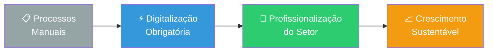

**Principais Problemas:**

1. 📊 **Avaliação Subjetiva**  
   → Instrutor escreve "voo satisfatório" sem dados concretos

2. 📄 **Gestão Manual Ineficiente**  
   → Papelada, cadernetas físicas, risco de perda

3. ⚖️ **Disputas Frequentes**  
   → Aluno questiona avaliação, não há evidências

4. 📋 **Burocracia com ANAC**  
   → Envio manual de documentos ao órgão regulador

5. 📈 **Dificuldade de Escalar**  
   → Processos manuais impedem crescimento eficiente

---

## 🏗️ ARQUITETURA DA SOLUÇÃO

### Visão Geral do Sistema
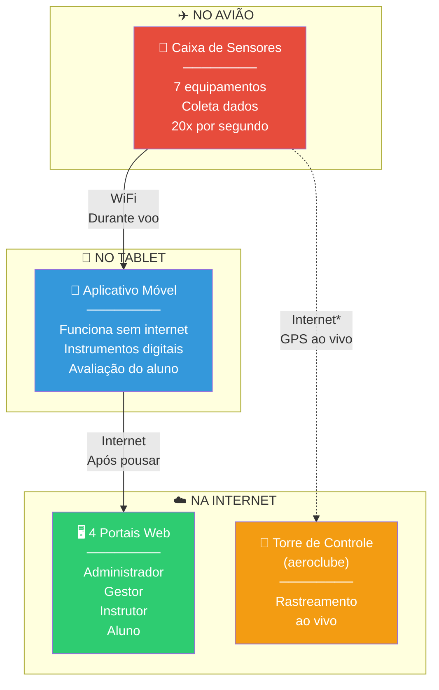

*Conexão com torre quando internet disponível

---

## 🔄 COMO FUNCIONA NA PRÁTICA

### Jornada Completa de um Voo

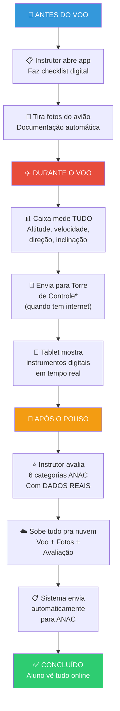

---

## 🔧 OS 3 COMPONENTES PRINCIPAIS

### 1️⃣ Caixa de Sensores no Avião

**O que é:**  
Equipamento eletrônico do tamanho de uma caixa de celular que fica instalado no avião.

**O que mede:**

| Sensor | Função |
|--------|--------|
| 🗺️ GPS | Localização exata do avião |
| 📏 Barômetro | Altitude (altura) |
| 🧭 Bússola Digital | Direção que está indo |
| ⚡ Acelerômetro | Subidas, descidas, curvas |
| 🔄 Giroscópio | Inclinação das asas |
| 🌡️ Temperatura | Condições do ambiente |

**Frequência de Medição:**  
→ **20 vezes por segundo** (dados extremamente precisos)

**Transmissão:**  
→ Envia dados via **WiFi** para o tablet do instrutor  
→ Funciona **mesmo sem internet** durante o voo

---

### 2️⃣ Aplicativo no Tablet do Instrutor

**Características Principais:**

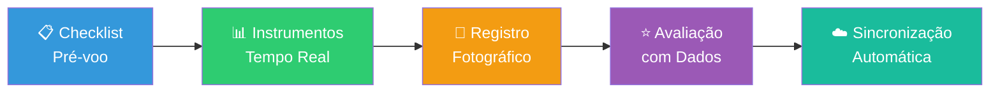

**Funcionalidades:**

1. **📊 Painel de Instrumentos**  
   → 6 instrumentos digitais (altitude, velocidade, direção...)  
   → Instrutor acompanha tudo em tempo real

2. **✅ Checklist Digital**  
   → Verificações antes do voo (combustível, freios, etc)  
   → Marca itens digitalmente

3. **⭐ Avaliação do Aluno**  
   → 6 categorias conforme manual ANAC  
   → Sistema **sugere notas** baseado nos dados reais  
   → Instrutor pode ajustar manualmente

4. **📸 Captura de Fotos**  
   → Documenta estado do avião  
   → Salva automaticamente junto com o voo

**Diferencial Técnico:**  
→ **Funciona SEM internet** durante o voo  
→ Sincroniza automaticamente quando conectar na internet

---

### 3️⃣ Portais Web (4 Sistemas)

### 🔐 Portal do Administrador

**Quem acessa:** Equipe Aviônica  

**Funções:**
- 📊 Visão de todas as escolas usando o sistema
- 🗺️ Mapa com todos os aviões voando ao vivo
- 📈 Estatísticas gerais da plataforma
- ⚙️ Configurações do sistema

---

### 🏢 Portal do Gestor (Dono da Escola)

**Quem acessa:** Diretor/Gerente do aeroclube  

**Funções:**
- 👥 Cadastro de alunos e instrutores
- ✈️ Cadastro de aviões da frota
- 📅 Visualização da agenda de voos
- 📊 Relatórios gerenciais (horas voadas, custos...)
- 📈 Indicadores de performance da escola
- 💼 Gestão financeira e contratos

**Benefícios:**  
→ Controle total da operação  
→ Decisões baseadas em números reais  
→ Otimização de recursos

---

### 👨‍✈️ Portal do Instrutor

**Quem acessa:** Instrutores certificados  

**Funções:**
- 📋 Lista de todos os seus alunos
- 📊 Progresso individual de cada aluno
- 🗺️ **Replay do Voo:** ver no mapa o caminho que o avião fez
- 📈 Gráficos de desempenho (altitude, velocidade ao longo do tempo)
- 📄 Caderneta Digital (CIV) pronta para ANAC

**Diferencial Único:**  
→ 🎬 **Replay Interativo:** clicar em qualquer momento do voo e ver:
   - Posição no mapa  
   - Todos os dados daquele segundo  
   - O que o instrutor anotou

---

### 🎓 Portal do Aluno

**Quem acessa:** Alunos em formação  

**Funções:**
- ✈️ Histórico completo dos meus voos
- ⭐ Todas as avaliações recebidas
- 📈 Meu progresso (quantas horas fiz, quanto falta)
- 📄 Minha Caderneta Digital oficial (download)
- 📁 Meus documentos (exames médicos, certificados)
- 🎯 Roadmap até tirar o brevê

**Benefícios:**  
→ Transparência total  
→ Acompanha própria evolução  
→ Acesso a documentos oficiais 24/7

---

## 🎯 BENEFÍCIOS POR PERFIL

### Para o Aluno

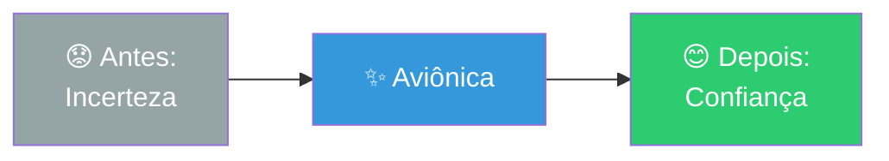

- ✅ **Transparência:** Vê dados reais do seu voo
- ✅ **Clareza:** Sabe exatamente o que precisa melhorar
- ✅ **Motivação:** Acompanha sua evolução
- ✅ **Segurança:** Avaliação baseada em fatos, não opinião
- ✅ **Praticidade:** Acessa tudo pelo celular

---

### Para o Instrutor

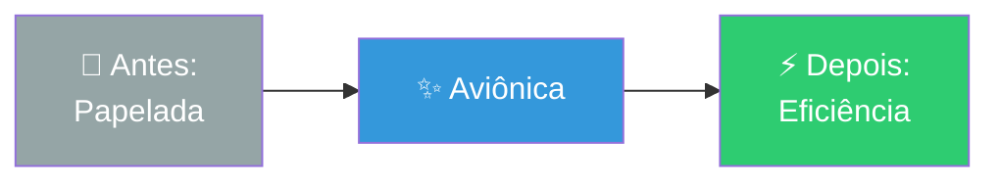

- ✅ **Menos burocracia:** Sem papel, tudo digital
- ✅ **Avaliação justa:** Dados reais comprovam a nota
- ✅ **Menos conflitos:** Aluno vê os dados e entende
- ✅ **Profissionalismo:** Ferramenta moderna e séria
- ✅ **Foco no ensino:** Mais tempo voando, menos tempo com papelada

---

### Para o Gestor (Escola)

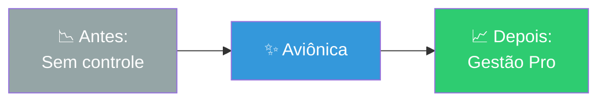

- ✅ **Controle operacional:** Dados de tudo que acontece
- ✅ **Satisfação dos alunos:** Transparência aumenta retenção
- ✅ **Conformidade ANAC:** Automático, sem risco de multa
- ✅ **Diferencial competitivo:** "Nossa escola é high-tech"
- ✅ **Crescimento sustentável:** Operação profissional atrai mais alunos
- ✅ **Redução de custos:** Elimina processos manuais

---

## 🏆 POR QUE SOMOS DIFERENTES?

### Comparação com Concorrentes

| Aspecto | Concorrentes<br/>(SAGA, Alis, Plane It) | 🚀 AVIÔNICA |
|---------|-------------------------------------------|-------------|
| **Telemetria Real** | ❌ Não possuem | ✅ **Caixa própria no avião** |
| **Coleta de Dados** | ❌ Manual/estimativa | ✅ **Sensores reais 20x/segundo** |
| **Avaliação** | ❌ Texto livre | ✅ **Números + dados objetivos** |
| **Replay de Voo** | ❌ Não existe | ✅ **Replay interativo no mapa** |
| **Portal do Aluno** | ⚠️ Básico | ✅ **Portal completo com progresso** |
| **ANAC Automático** | ⚠️ Parcial/Manual | ✅ **100% automatizado** |
| **Rastreamento Vivo** | ❌ Não | ✅ **GPS ao vivo na torre** |
| **Funciona Offline** | ⚠️ Limitado | ✅ **App totalmente offline** |

### Nossos Diferenciais Únicos

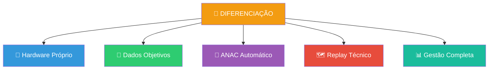

**Posicionamento:**  
> *"Somos os únicos que colocam HARDWARE REAL no avião para coletar dados verdadeiros, transformando avaliação subjetiva em análise objetiva e automatizando 100% do compliance com ANAC."*

---

## 📊 ESTRATÉGIA DE MERCADO

### Plano de Crescimento por Fases

#### Fase 1: VALIDAÇÃO (6 meses)
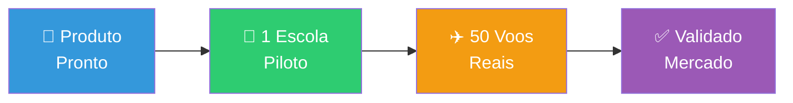

**Meta:** Provar que funciona no mundo real

---

#### Fase 2: PRIMEIROS CLIENTES (12 meses)
```
🎯 Meta: 3-5 escolas
👥 Alunos: 150-250
📈 Foco: Refinar produto
💼 Vendas: Diretas e consultivas
```

---

#### Fase 3: CRESCIMENTO (24 meses)
```
🎯 Meta: 10-15 escolas
👥 Alunos: 500-750
📈 Foco: Escalar operação
💼 Vendas: Equipe comercial + marketing
```

---

#### Fase 4: CONSOLIDAÇÃO (36+ meses)
```
🎯 Meta: 50+ escolas
👥 Mercado: Nacional e internacional
📈 Foco: Liderança de mercado
💼 Vendas: Parcerias estratégicas
```

---

## 📋 SÍNTESE EXECUTIVA

### O Que É o Aviônica em 3 Pontos

```
1. 📡 CAIXA NO AVIÃO
   └─ Hardware com 7 sensores que mede tudo 20x por segundo

2. 📱 APP NO TABLET
   └─ Funciona offline, mostra instrumentos, avalia aluno

3. ☁️ 4 PORTAIS WEB
   └─ Administrador, Gestor, Instrutor e Aluno
```

---

### Por Que Somos Únicos?

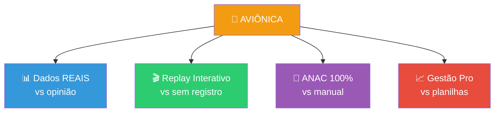

---

### Momento Ideal de Mercado

**Convergência de Fatores:**

1. ✅ **Regulatório:** ANAC exige Caderneta Digital desde 2022
2. ✅ **Tecnológico:** Sensores baratos e acessíveis hoje
3. ✅ **Geracional:** Alunos jovens exigem transparência
4. ✅ **Competitivo:** Concorrentes sem hardware = oportunidade
5. ✅ **Econômico:** Setor se modernizando pós-pandemia

---

### Visão de Longo Prazo

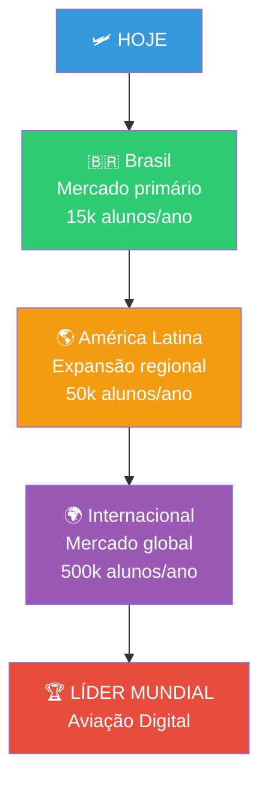

---

### Nossa Declaração de Valor

> **"Aviônica transforma escolas de aviação através de dados reais de voo, substituindo avaliações subjetivas por análise objetiva e automatizando 100% do compliance regulatório."**

---

## 🔒 VANTAGENS COMPETITIVAS SUSTENTÁVEIS

**Por Que Seremos Difíceis de Copiar:**

1. **📡 Hardware Proprietário:** Nossos sensores e protocolos
2. **📊 Base de Dados:** Anos de voos reais coletados
3. **🤝 Integração ANAC:** Homologação oficial na API
4. **👥 Efeito Rede:** Quanto mais escolas, mais valioso o sistema
5. **🧠 Inteligência:** Algoritmos treinados com nossos dados

---

## 🎬 CONCLUSÃO

### Por Que Vamos Vencer?

```
✅ Problema real e validado no mercado
✅ Solução única (somos os únicos com hardware)
✅ Timing regulatório perfeito (ANAC obriga digitalização)
✅ Modelo recorrente escalável
✅ Expansão internacional viável
✅ Equipe técnica capacitada
```

### Próximos Marcos Críticos

```
1. 🔬 MVP pronto (Q1 2026)
2. 🎯 Homologação ANAC (Q2 2026)
3. 🏫 Escola piloto operando (Q2 2026)
4. 📊 Resultados comprovados (Q3 2026)
5. 💼 Expansão comercial (Q4 2026)
```

---

**🛩️ Aviônica: Transformando a aviação brasileira com dados reais.**

---

*Documento Executivo | Versão 3.1 | Novembro 2025*