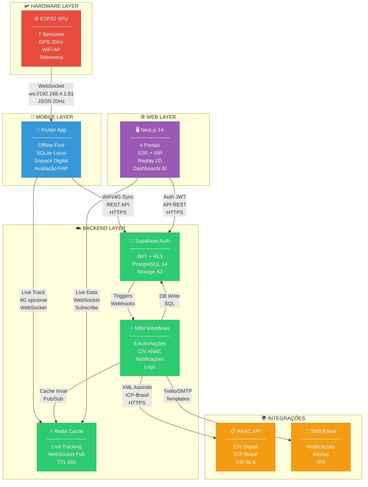
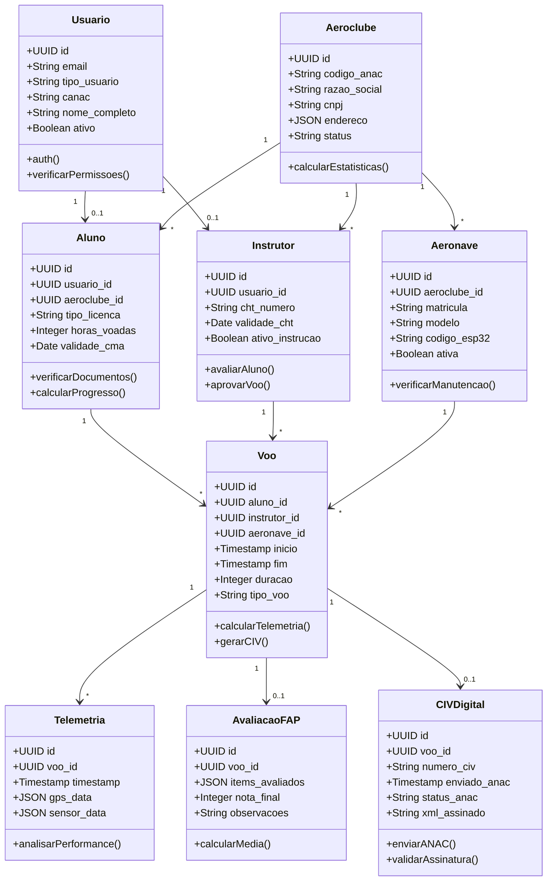
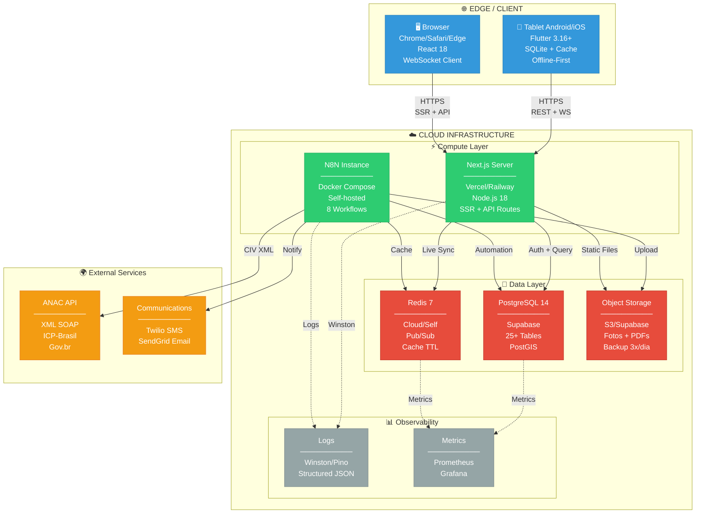
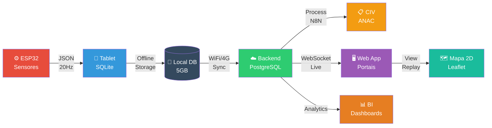
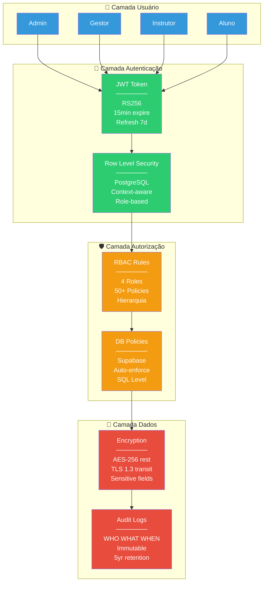
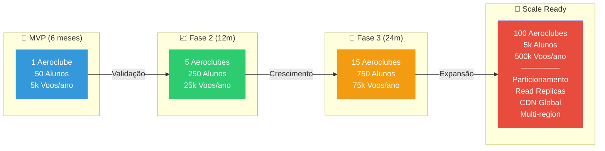
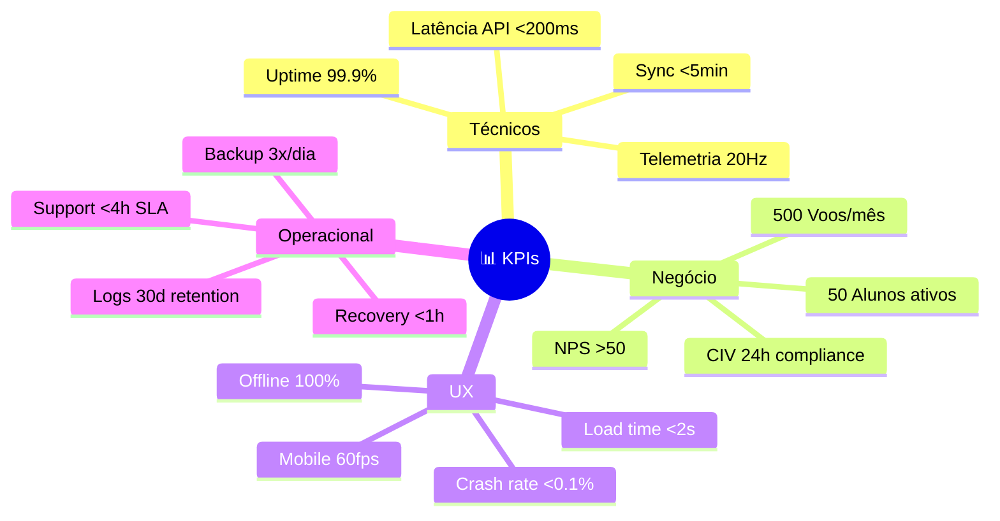

# 🏗️ ARQUITETURA UML - AVIÔNICA MVP

**📅 Data:** 06/11/2025  
**🎯 Propósito:** Visão macro de componentes e integrações  
**👥 Audiência:** CTO, Arquitetos, Tech Leads

---

## 📑 ÍNDICE

1. [🎨 Diagrama de Componentes - Nível 1 (Macro)](#-diagrama-de-componentes---nível-1-macro)
2. [📊 Diagrama de Classes - Entidades Principais](#-diagrama-de-classes---entidades-principais)
3. [🔄 Diagrama de Deployment](#-diagrama-de-deployment)
4. [📡 Fluxo de Dados - Visão Geral](#-fluxo-de-dados---visão-geral)
5. [🔐 Camadas de Segurança](#-camadas-de-segurança)
6. [📈 Escalabilidade - Estratégia](#-escalabilidade---estratégia)
7. [🎯 Decisões Arquiteturais - Chaves](#-decisões-arquiteturais---chaves)
8. [🔧 Tecnologias - Stack Completo](#-tecnologias---stack-completo)
9. [📊 Métricas de Sucesso - KPIs](#-métricas-de-sucesso---kpis)
10. [✅ Checklist Implementação (6 meses / 12 sprints)](#-checklist-implementação)
11. [🎓 Referências Arquiteturais](#-referências-arquiteturais)

---

## 🎨 DIAGRAMA DE COMPONENTES - NÍVEL 1 (MACRO)



---

## 📊 DIAGRAMA DE CLASSES - ENTIDADES PRINCIPAIS



---

## 🔄 DIAGRAMA DE DEPLOYMENT



---

## 📡 FLUXO DE DADOS - VISÃO GERAL



---

## 🔐 CAMADAS DE SEGURANÇA



---

## 📈 ESCALABILIDADE - ESTRATÉGIA



---

## 🎯 DECISÕES ARQUITETURAIS - CHAVES

| # | Decisão | Alternativa Rejeitada | Justificativa |
|---|---------|----------------------|---------------|
| **1** | 🔐 **Supabase Auth** | Auth0, Firebase Auth | Open-source, PostgreSQL native, RLS automático |
| **2** | ⚡ **N8N Workflows** | Zapier, Make | Self-hosted, sem limites, visual, barato |
| **3** | 📱 **Flutter Mobile** | React Native, Native | Single codebase, performance, offline-first |
| **4** | 🖥️ **Next.js Web** | Vue/Nuxt, SvelteKit | SEO, SSR/ISR, React ecosystem, Vercel |
| **5** | 💾 **PostgreSQL** | MongoDB, MySQL | Relacional, PostGIS, Supabase, ACID |
| **6** | ⚡ **Redis Cache** | Memcached, In-memory | Pub/Sub, estruturas avançadas, persistência |
| **7** | 🗺️ **Leaflet 2D** | Cesium 3D, Mapbox GL | Leve, offline, tiles gratuitos, suficiente MVP |
| **8** | ☁️ **Vercel Deploy** | AWS, GCP, Azure | DX excelente, CI/CD automático, edge network |

---

## 🔧 TECNOLOGIAS - STACK COMPLETO

### 🎨 Frontend

```yaml
Mobile:
  • Flutter 3.16+ (Dart 3.2)
  • Packages: 15+ essenciais
  • Target: Android 8+ / iOS 13+
  • Size: ~50MB APK

Web:
  • Next.js 14 (React 18)
  • TypeScript 5+
  • TailwindCSS 3
  • shadcn/ui components
  • Chart.js + Recharts
  • Leaflet 2D maps
```

### ⚙️ Backend

```yaml
Runtime:
  • Node.js 18 LTS
  • N8N (self-hosted)
  • Docker Compose

Database:
  • PostgreSQL 14 (Supabase)
  • PostGIS (geo)
  • Redis 7 (cache)

Storage:
  • S3 / Supabase Storage
  • ~10GB/aeroclube/mês
```

### 🛠️ DevOps

```yaml
CI/CD:
  • GitHub Actions
  • Vercel (auto-deploy)
  • Docker (N8N)

Monitoring:
  • Sentry (errors)
  • Prometheus (metrics)
  • Grafana (dashboards)
  • Winston (logs)

Testing:
  • Jest (unit)
  • Playwright (e2e)
  • Flutter test
```

---

## 📊 MÉTRICAS DE SUCESSO - KPIs



---

## ✅ CHECKLIST IMPLEMENTAÇÃO

**⏱️ Timeline Total:** 6 meses (24 semanas)  
**🎯 Objetivo:** MVP em produção com 1 aeroclube piloto  
**👥 Time:** 3 Devs + 1 QA

---

### 📅 FASE 1: DESENVOLVIMENTO MVP (Meses 1-3)

#### Sprint 1-2 (Semanas 1-4) - Fundação
**🎯 Objetivo:** Infraestrutura base + protótipo funcional

**☁️ Backend:**
- [ ] Setup Supabase projeto + Auth (JWT + RLS)
- [ ] PostgreSQL: 25 tabelas criadas + migrations
- [ ] N8N: Setup Docker Compose self-hosted
- [ ] N8N: 3 workflows iniciais (sync, logs, notificações)
- [ ] Redis: Setup + config Pub/Sub
- [ ] API REST: 10 endpoints base (CRUD)

**📱 Mobile:**
- [ ] Flutter scaffold + estrutura pastas
- [ ] Tela: Login/Auth (email + senha)
- [ ] Tela: Dashboard instrutor (home)
- [ ] WebSocket: Conectar ESP32 test (mock data)
- [ ] SQLite: Setup local database
- [ ] Hive: Cache configuração

**🖥️ Web:**
- [ ] Next.js scaffold + TypeScript
- [ ] Página: Login admin/gestor
- [ ] Auth: Supabase integration
- [ ] Layout: Sidebar + header base

---

#### Sprint 3-4 (Semanas 5-8) - Features Core Mobile
**🎯 Objetivo:** App instrutor funcional offline

**☁️ Backend:**
- [ ] N8N: Workflow sync voo completo
- [ ] N8N: Workflow CIV ANAC (sandbox)
- [ ] API: POST /voos/sync (multipart)
- [ ] API: GET /voos/:id/telemetria
- [ ] Storage S3: Upload fotos + PDFs

**📱 Mobile:**
- [ ] Tela: Selecionar aluno (lista offline)
- [ ] Tela: Selecionar aeronave (lista offline)
- [ ] Tela: Plano de voo (upload PDF)
- [ ] Tela: Sixpack digital (6 instrumentos tempo real)
- [ ] Tela: Iniciar/finalizar voo
- [ ] Feature: Gravação telemetria local (SQLite)
- [ ] Feature: Offline-first completo
- [ ] Feature: Monitoramento bateria tablet

**🖥️ Web:**
- [ ] Portal Gestor: Dashboard estatísticas
- [ ] Portal Gestor: CRUD alunos
- [ ] Portal Gestor: CRUD instrutores
- [ ] Portal Gestor: CRUD aeronaves

---

#### Sprint 5-6 (Semanas 9-12) - Features Core Web + Avaliação
**🎯 Objetivo:** Avaliação FAP + CIV + Portais Web

**☁️ Backend:**
- [ ] N8N: Workflow CIV retry automático (3x)
- [ ] N8N: Workflow email notificações
- [ ] N8N: Workflow SMS alertas
- [ ] API: POST /avaliacoes-fap
- [ ] API: GET /civ-digital/:voo_id

**📱 Mobile:**
- [ ] Tela: Checklist digital (15 items)
- [ ] Tela: Fotos checklist (câmera + galeria)
- [ ] Tela: Avaliação FAP (8 categorias + notas)
- [ ] Tela: Assinatura digital (canvas)
- [ ] Tela: Diário de bordo (logs texto)
- [ ] Feature: Sincronização WiFi/4G
- [ ] Feature: Live tracking 4G (opcional)

**🖥️ Web:**
- [ ] Portal Admin: Dashboard global
- [ ] Portal Admin: Lista aeroclubes (CRUD)
- [ ] Portal Admin: Métricas avançadas (BI)
- [ ] Portal Admin: Live tracking global
- [ ] Portal Instrutor: Meus voos (lista)
- [ ] Portal Instrutor: Visualizar avaliação
- [ ] Portal Aluno: Meus voos (simplificado)
- [ ] Portal Aluno: CIV download
- [ ] Feature: Replay 2D Leaflet (mapa + timeline)

---

### 📅 FASE 2: VALIDAÇÃO + PRODUÇÃO (Meses 4-6)

#### Sprint 7-8 (Semanas 13-16) - Beta Testing Real
**🎯 Objetivo:** Aeroclube piloto usando sistema real

**🛩️ Hardware:**
- [ ] Montar 2 unidades ESP32 SPU completas
- [ ] Instalar em 2 aeronaves piloto
- [ ] Testar sensores (calibração + accuracy)
- [ ] Criar manual instalação hardware

**📱 Mobile + 🖥️ Web:**
- [ ] Bugs críticos corrigidos (P0/P1)
- [ ] UX refinamentos (feedback beta)
- [ ] Performance otimização (< 2s load)
- [ ] Crash rate < 0.1%

**👥 Operacional:**
- [ ] Treinar 3 instrutores aeroclube piloto
- [ ] Treinar 1 gestor aeroclube
- [ ] Acompanhar 20 voos reais
- [ ] Coletar feedback estruturado (form)
- [ ] Ajustar features baseado em feedback

**📊 Métricas Beta:**
- [ ] 50+ voos gravados
- [ ] 10+ alunos cadastrados
- [ ] 20+ CIV gerados (sandbox)
- [ ] NPS beta > 40

---

#### Sprint 9-10 (Semanas 17-20) - Homologação ANAC + Security
**🎯 Objetivo:** Compliance regulatório + segurança

**📋 ANAC:**
- [ ] Documentação técnica completa
- [ ] Certificado ICP-Brasil (produção)
- [ ] CIV sandbox → produção (migração)
- [ ] Testes conformidade RBAC 141
- [ ] Protocolo 24h SLA validado
- [ ] Homologação ANAC aprovada ✅

**🔒 Security:**
- [ ] Audit logs implementado (5yr retention)
- [ ] Penetration testing (terceirizado)
- [ ] LGPD compliance checklist
- [ ] Criptografia AES-256 (dados sensíveis)
- [ ] Backup geo-redundante (3x/dia)
- [ ] Disaster recovery testado (RTO < 1h)

**⚡ Performance:**
- [ ] Load testing: 1000 concurrent users
- [ ] Stress testing: 10k voos/mês
- [ ] Telemetria: 20Hz sem perda (99%+)
- [ ] API latency: p95 < 200ms
- [ ] Uptime: 99.9% comprovado (30d)

---

#### Sprint 11-12 (Semanas 21-24) - Produção + Go-Live
**🎯 Objetivo:** Sistema estável em produção

**🚀 Deploy Produção:**
- [ ] Vercel: Web app produção
- [ ] Railway: N8N produção
- [ ] Supabase: Database produção
- [ ] Redis: Cache produção
- [ ] S3: Storage produção
- [ ] CI/CD: GitHub Actions (auto-deploy)

**📊 Monitoring:**
- [ ] Sentry: Error tracking live
- [ ] Prometheus: Metrics collection
- [ ] Grafana: Dashboards 24/7
- [ ] PagerDuty: Alertas on-call
- [ ] StatusPage: Status público

**👥 Onboarding:**
- [ ] Manual instrutor completo (PDF + vídeos)
- [ ] Manual gestor completo
- [ ] FAQ + troubleshooting
- [ ] Suporte: Email + WhatsApp (4h SLA)
- [ ] Treinamento remoto (2h/aeroclube)

**📈 Go-Live:**
- [ ] Aeroclube piloto: Produção ativa
- [ ] Marketing: Landing page + materiais
- [ ] Vendas: Pitch deck + proposta comercial
- [ ] 🎉 **MVP OFICIAL EM PRODUÇÃO**

---

### 📊 RESUMO CRONOGRAMA 6 MESES

```
┌─────────────────────────────────────────────────────────────────┐
│  MÊS 1-2: Sprint 1-4  │  Fundação + Core Mobile                 │
│  ├─ Backend base      │  ├─ Offline-first                       │
│  ├─ Mobile scaffold   │  ├─ Sixpack digital                    │
│  └─ Web base          │  └─ Avaliação FAP                       │
├─────────────────────────────────────────────────────────────────┤
│  MÊS 3: Sprint 5-6    │  Core Web + Integração                  │
│  ├─ CIV ANAC         │  ├─ Replay 2D                           │
│  ├─ 4 Portais web    │  ├─ Live tracking                       │
│  └─ Sync completo    │  └─ MVP funcional ✅                     │
├─────────────────────────────────────────────────────────────────┤
│  MÊS 4: Sprint 7-8    │  Beta Testing Real                      │
│  ├─ Hardware install │  ├─ 20 voos reais                       │
│  ├─ Treinar users    │  ├─ Coletar feedback                    │
│  └─ Bug fixing       │  └─ UX refinamento                       │
├─────────────────────────────────────────────────────────────────┤
│  MÊS 5: Sprint 9-10   │  Homologação + Security                 │
│  ├─ ANAC produção    │  ├─ Pen testing                         │
│  ├─ Load testing     │  ├─ LGPD compliance                     │
│  └─ DR testing       │  └─ Audit logs                          │
├─────────────────────────────────────────────────────────────────┤
│  MÊS 6: Sprint 11-12  │  Produção + Go-Live                     │
│  ├─ Deploy prod      │  ├─ Monitoring 24/7                     │
│  ├─ Onboarding       │  ├─ Suporte setup                       │
│  └─ 🎉 GO-LIVE        │  └─ Marketing/vendas                    │
└─────────────────────────────────────────────────────────────────┘
```

---

### 🎯 MILESTONES CRÍTICOS

| Semana | Milestone | Critério Sucesso |
|--------|-----------|------------------|
| **4** | 🎯 Protótipo Mobile | Conecta ESP32 + grava telemetria local |
| **8** | 🎯 MVP Offline Funcional | Voo completo offline sem bugs críticos |
| **12** | 🎯 MVP Completo | 4 portais + CIV ANAC + Replay 2D |
| **16** | 🎯 Beta Validado | 50 voos reais + NPS > 40 |
| **20** | 🎯 Homologação ANAC | CIV produção aprovado |
| **24** | 🎉 **GO-LIVE PRODUÇÃO** | 1 aeroclube ativo pagante |

---

### 👥 RECURSOS NECESSÁRIOS

**Time Core:**
- 1x Dev Full-Stack (Backend + N8N + DevOps)
- 1x Dev Mobile (Flutter expert)
- 1x Dev Frontend (Next.js + React)
- 1x QA (testes E2E + homologação)

**Tempo Parcial:**
- 1x UI/UX Designer (sprints 1-6, 30%)
- 1x DevOps (sprints 9-12, 50%)
- 1x Advogado (ANAC + LGPD, sprints 9-10)

**Custo Estimado 6 Meses:**
```yaml
Salários: R$ 180.000 (3 devs + 1 QA)
Infra cloud: R$ 3.600 (R$ 600/mês)
Ferramentas: R$ 6.000 (licenças/SaaS)
Hardware: R$ 4.800 (2 ESP32 completos)
Terceiros: R$ 15.000 (pen test + legal)
────────────────────────────────────
TOTAL: ~R$ 210.000 (MVP completo)
```

---

## 🎓 REFERÊNCIAS ARQUITETURAIS

**Padrões Aplicados:**
- 🏗️ **Clean Architecture** (Robert C. Martin)
- 🔷 **Domain-Driven Design** (Eric Evans)
- ⚡ **Event-Driven Architecture** (webhooks/triggers)
- 🎯 **CQRS Light** (read/write separation)
- 🛡️ **Security by Design** (OWASP Top 10)

**Inspirações:**
- 📊 **Flightradar24** (live tracking)
- 🎮 **Strava** (replay + análise)
- 📚 **Notion** (offline-first)
- 🏥 **Epic Systems** (regulatório healthcare)

---

**✅ DIAGRAMA COMPLETO**  
**📊 Tokens restantes:** ~161.000  
**⏭️ Próximo:** Diagramas de Sequência