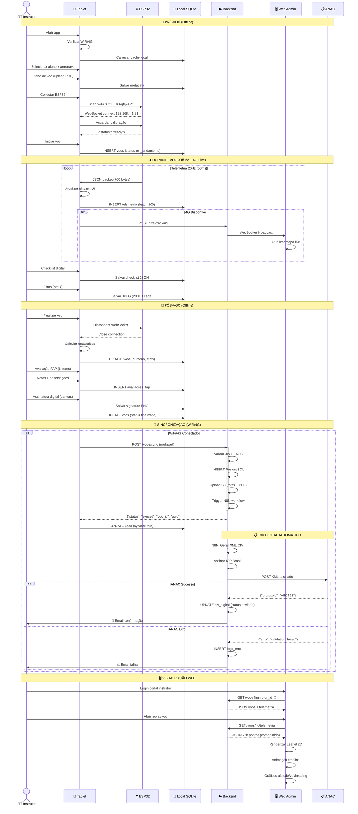
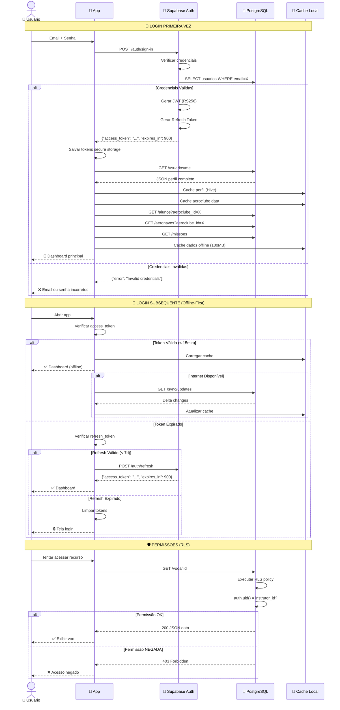
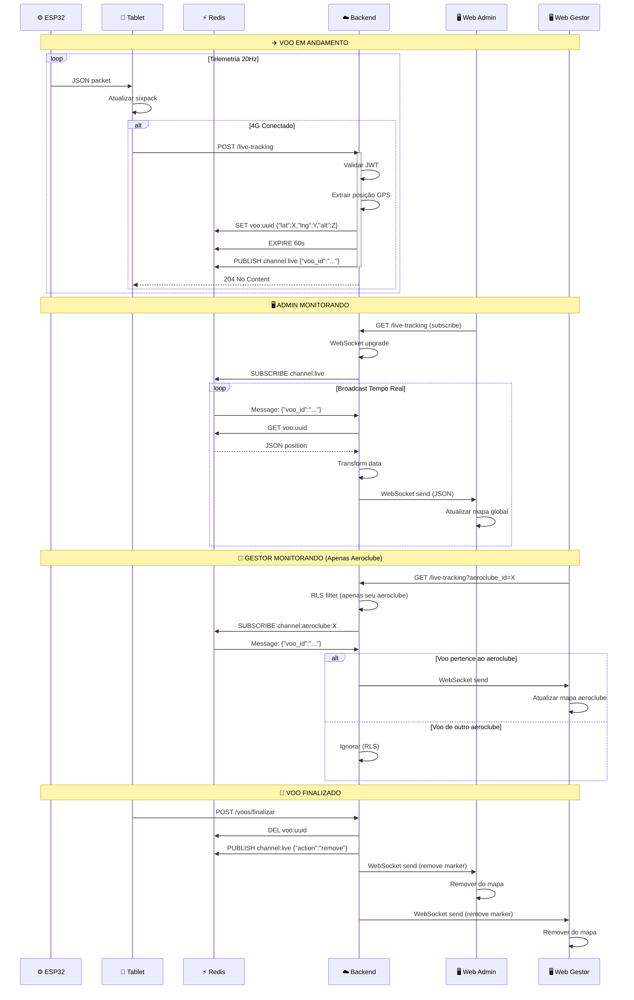
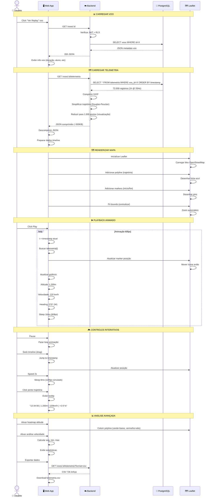
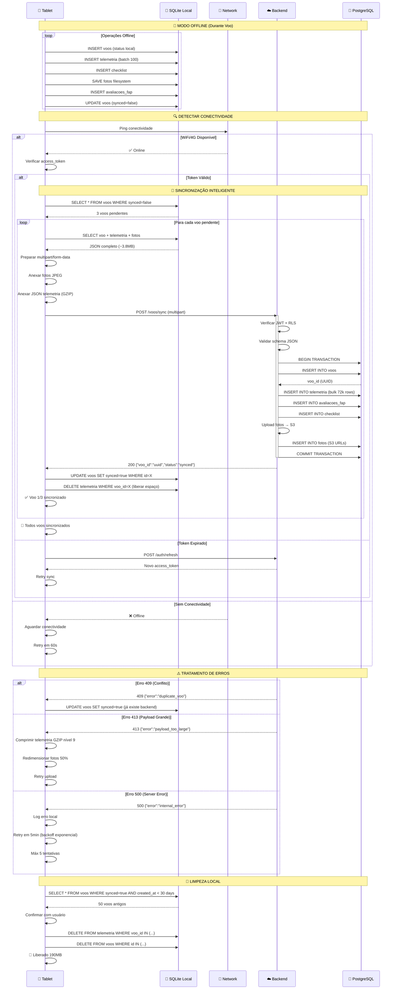
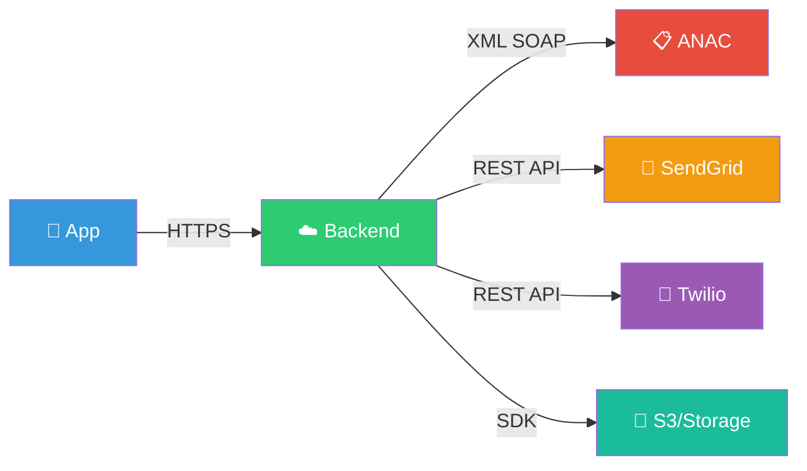

# 🔄 DIAGRAMAS DE SEQUÊNCIA - AVIÔNICA MVP

**📅 Data:** 06/11/2025  
**🎯 Propósito:** Fluxos macro de interação entre componentes  
**👥 Audiência:** Desenvolvedores, QA, Product

---

## 📋 ÍNDICE DE FLUXOS

1. ✈️ **Fluxo Completo de Voo** (end-to-end)
2. 🔐 **Autenticação e Setup**
3. 📊 **Live Tracking 4G**
4. 📋 **CIV Digital ANAC**
5. 🗺️ **Replay 2D Telemetria**
6. ⚡ **Sincronização Offline → Online**

---

## 1️⃣ FLUXO COMPLETO DE VOO (END-TO-END)



---

## 2️⃣ AUTENTICAÇÃO E SETUP INICIAL



---

## 3️⃣ LIVE TRACKING 4G (TEMPO REAL)



---

## 4️⃣ CIV DIGITAL ANAC (AUTOMÁTICO)

```mermaid
sequenceDiagram
    participant T as 📱 Tablet
    participant B as ☁️ Backend
    participant N as ⚡ N8N
    participant P as 💾 PostgreSQL
    participant A as 📋 ANAC API
    participant I as 📧 Instrutor

    Note over T,I: 🔄 TRIGGER PÓS-SYNC
    
    T->>B: POST /voos/sync
    activate B
    B->>P: INSERT voos + telemetria
    B->>P: INSERT webhook_queue
    deactivate B
    
    B-->>T: 200 Synced
    
    Note over T,I: ⚡ N8N WORKFLOW (Async)
    
    P->>N: Trigger: new_voo_webhook
    activate N
    
    N->>P: SELECT voos WHERE id=X (JOIN aluno, instrutor)
    P-->>N: JSON voo completo
    
    N->>N: Validar dados obrigatórios
    
    alt Dados Completos
        
        Note over N,A: 📄 GERAR XML CIV
        
        N->>N: Template XML ANAC
        N->>N: Preencher campos
        N->>N: Calcular totalizadores
        N->>N: Adicionar telemetria agregada
        
        Note over N,A: ✍️ ASSINAR ICP-BRASIL
        
        N->>N: Carregar certificado digital
        N->>N: Assinar XML (RSA-SHA256)
        N->>N: Validar assinatura
        
        N->>P: INSERT civ_digital (xml_assinado)
        
        Note over N,A: 📤 ENVIAR ANAC
        
        N->>A: POST /ws/civ/enviar (XML assinado)
        activate A
        
        A->>A: Validar XML schema
        A->>A: Validar assinatura
        A->>A: Validar CANAC instrutor
        A->>A: Validar CANAC aluno
        A->>A: Processar voo
        
        alt ANAC Sucesso ✅
            A-->>N: 200 {"protocolo":"ABC123","status":"processado"}
            deactivate A
            
            N->>P: UPDATE civ_digital (status enviado, protocolo ABC123)
            
            N->>I: 📧 Email: CIV Enviado com Sucesso
            N->>I: 📱 SMS: CIV ABC123 processado
            
        else ANAC Erro ❌
            A-->>N: 400 {"erro":"validation_failed","detalhes":"..."}
            deactivate A
            
            N->>P: UPDATE civ_digital (status erro, erro_msg detalhes)
            N->>P: INSERT logs_anac_erro
            
            N->>I: 📧 Email: Erro ao Enviar CIV
            N->>I: ⚠️ SMS: CIV falhou - verificar portal
            
            Note over N,I: 🔁 RETRY AUTOMÁTICO
            
            N->>N: Sleep 5 minutos
            N->>N: Retry attempt 2/3
            N->>A: POST /ws/civ/enviar (retry)
            
            alt Retry Sucesso
                A-->>N: 200 OK
                N->>P: UPDATE civ_digital (status enviado)
                N->>I: 📧 Email: CIV Enviado (retry)
            else Retry Falhou
                A-->>N: 400 Error
                N->>P: UPDATE civ_digital (tentativas=3, requires_manual=true)
                N->>I: 🚨 Email: Ação Manual Necessária
            end
        end
        
    else Dados Incompletos
        N->>P: INSERT logs_validacao_erro
        N->>I: ⚠️ Email: CIV não enviado - dados faltando
    end
    
    deactivate N
    
    Note over T,I: 🖥️ INSTRUTOR VERIFICA PORTAL
    
    I->>B: GET /civ-digital?voo_id=X
    B->>P: SELECT civ_digital
    P-->>B: JSON status CIV
    B-->>I: Exibir status + protocolo ANAC
```

---

## 5️⃣ REPLAY 2D TELEMETRIA (WEB)



---

## 6️⃣ SINCRONIZAÇÃO OFFLINE → ONLINE



---

## 🎯 MÉTRICAS DE PERFORMANCE

| Fluxo | Latência Target | Success Rate | Observações |
|-------|-----------------|--------------|-------------|
| **ESP32 → Tablet** | <50ms | >99% | WebSocket 20Hz |
| **Tablet → Backend** | <200ms | >95% | Sync assíncrono |
| **Live Tracking** | <100ms | >98% | Redis Pub/Sub |
| **CIV ANAC** | <5s | >99.5% | Retry automático 3x |
| **Replay Load** | <2s | >99% | Compressão GZIP |
| **Auth Login** | <500ms | >99.9% | Supabase Auth |

---

## ⚠️ PONTOS DE ATENÇÃO

### 🔴 Críticos
- ❗ **Perda pacotes ESP32**: Ignorar, não reenviar (não afetar UX)
- ❗ **WiFi loss mid-flight**: Log evento, continuar gravação
- ❗ **Bateria tablet**: Monitorar, alertar <20%
- ❗ **Storage cheio**: Limpar voos antigos sincronizados

### 🟡 Importantes
- ⚠️ **ANAC timeout**: Retry 3x, escalar manual
- ⚠️ **4G intermitente**: Buffer local, sync quando estável
- ⚠️ **Token expirado**: Refresh automático transparente

### 🟢 Otimizações
- ✅ **Telemetria bulk insert**: 100 registros/batch
- ✅ **Compressão GZIP**: 70% redução payload
- ✅ **Redis TTL**: 60s live tracking (garbage collect auto)

---

## 🔗 INTEGRAÇÕES EXTERNAS



---

## ✅ CHECKLIST IMPLEMENTAÇÃO

### Fluxo Voo Completo
- [ ] WebSocket ESP32 ↔ Tablet
- [ ] Gravação local SQLite
- [ ] Live tracking 4G
- [ ] Sincronização offline
- [ ] Avaliação FAP
- [ ] Fotos checklist

### CIV Digital
- [ ] Template XML ANAC
- [ ] Assinatura ICP-Brasil
- [ ] Envio SOAP API
- [ ] Retry automático
- [ ] Email notificações

### Replay 2D
- [ ] Leaflet map
- [ ] Polyline trajetória
- [ ] Playback animado
- [ ] Gráficos tempo real
- [ ] Export CSV

---

**✅ DIAGRAMAS COMPLETOS**  
**📊 Tokens restantes:** ~157.000  
**⏭️ Próximo:** Conteúdo Apresentação