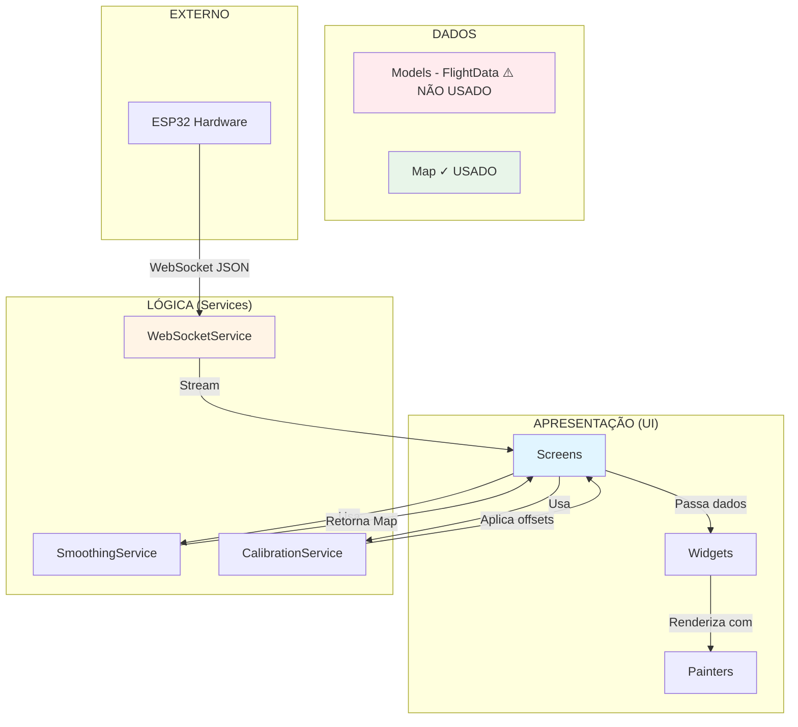
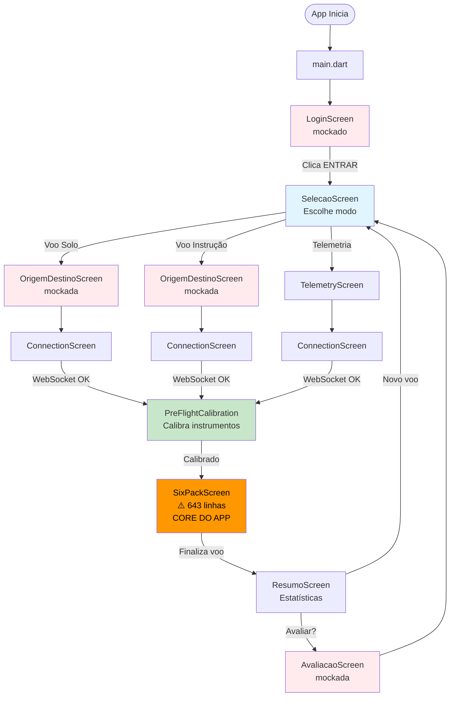
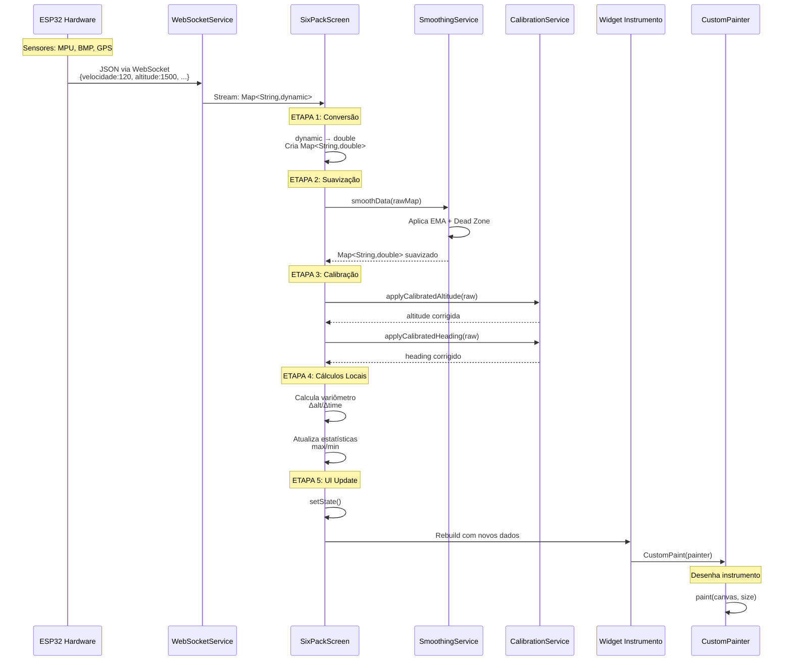
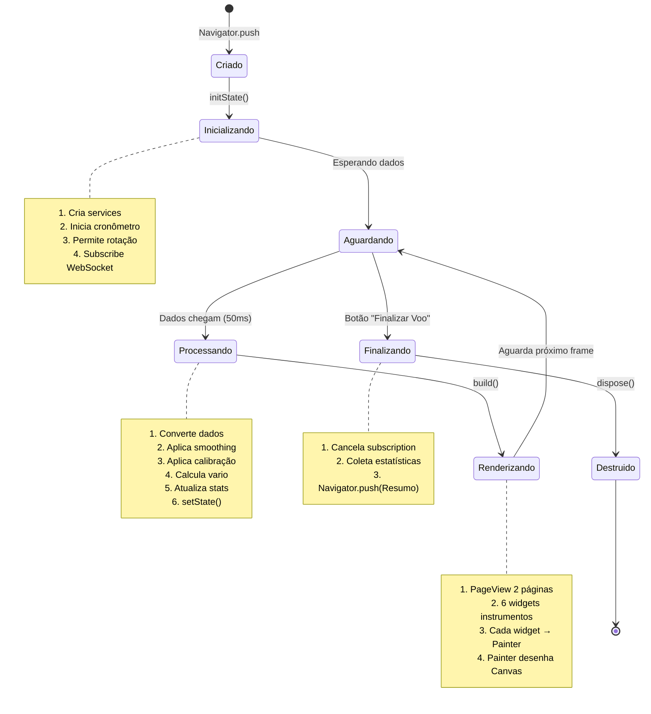
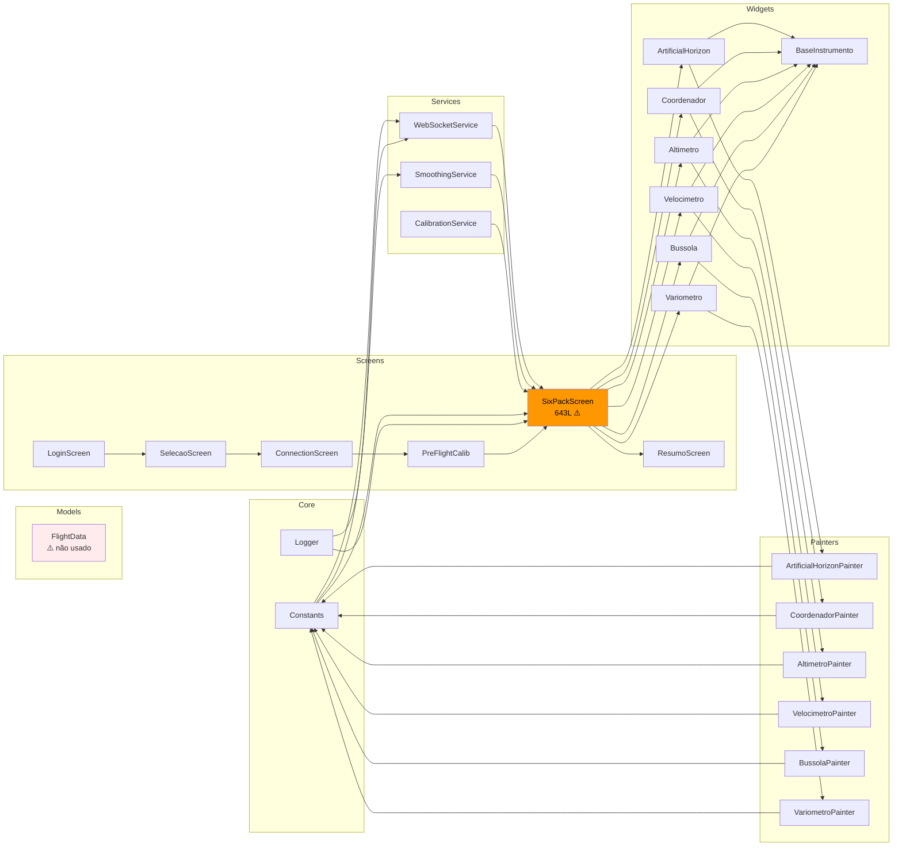

# DIAGRAMAS DE FLUXO - QFLY (Estado Atual)

**Formato:** Mermaid (pode ser visualizado no GitHub, VS Code, ou https://mermaid.live)

---

## 📋 ÍNDICE

1. [Arquitetura Geral](#1-arquitetura-geral)
2. [Fluxo de Navegação](#2-fluxo-de-navegação)
3. [Fluxo de Dados (ESP32 → Tela)](#3-fluxo-de-dados-esp32--tela)
4. [Ciclo de Vida do SixPackScreen](#4-ciclo-de-vida-do-sixpackscreen)
5. [Pipeline de Processamento](#5-pipeline-de-processamento)
6. [Estrutura de Classes](#6-estrutura-de-classes)

---

## 1. ARQUITETURA GERAL



---

## 2. FLUXO DE NAVEGAÇÃO



**Legenda:**
- 🟠 Laranja: Arquivo muito grande (problema)
- 🔴 Vermelho: Mockado (sem backend)
- 🟢 Verde: Funcional crítico
- 🔵 Azul: Funcional normal

---

## 3. FLUXO DE DADOS (ESP32 → Tela)



---

## 4. CICLO DE VIDA DO SIXPACKSCREEN



---

## 5. PIPELINE DE PROCESSAMENTO (DETALHADO)

```mermaid
flowchart TB
    START([Dados chegam do ESP32])
    
    START --> CONV{Conversão<br/>dynamic → double}
    CONV --> RAW[Map<String,double><br/>rawData]
    
    RAW --> SMOOTH[SmoothingService.smoothData]
    
    subgraph "Smoothing Service"
        SMOOTH --> FIRST{Primeira<br/>leitura?}
        FIRST -->|Sim| RETURN1[Retorna raw<br/>sem filtrar]
        FIRST -->|Não| EMA[Aplica EMA<br/>S = α*Y + 1-α*S]
        EMA --> DZ{|novo-atual|<br/>< deadZone?}
        DZ -->|Sim| KEEP[Mantém valor atual]
        DZ -->|Não| UPDATE[Atualiza com EMA]
        KEEP --> RETURN2[Retorna smoothed]
        UPDATE --> RETURN2
    end
    
    RETURN1 --> SMOOTHED[Map smoothed]
    RETURN2 --> SMOOTHED
    
    SMOOTHED --> CALIB[CalibrationService]
    
    subgraph "Calibration Service"
        CALIB --> APPLYH[heading + offset<br/>wrap 0-360°]
        CALIB --> APPLYP[pitch + offset]
        CALIB --> APPLYR[roll + offset]
        CALIB --> APPLYA[altitude + offset]
    end
    
    APPLYH --> CALIBRATED[Dados calibrados]
    APPLYP --> CALIBRATED
    APPLYR --> CALIBRATED
    APPLYA --> CALIBRATED
    
    CALIBRATED --> VARIO{Calcular<br/>Variômetro?}
    
    VARIO -->|Passou 500ms| CALCV[Δalt = alt - alt_prev<br/>vario = Δalt/Δtime<br/>vario_smooth = EMA]
    VARIO -->|< 500ms| KEEPV[Mantém vario atual]
    
    CALCV --> STATS[Atualizar<br/>Estatísticas]
    KEEPV --> STATS
    
    STATS --> SETSTATE[setState]
    SETSTATE --> BUILD[build]
    BUILD --> UI[Renderiza 6 instrumentos]
    
    UI --> END([Aguarda próximo frame])
    
    style SMOOTH fill:#fff9c4
    style CALIB fill:#c5cae9
    style VARIO fill:#c8e6c9
    style UI fill:#e1f5ff
```

---

## 6. ESTRUTURA DE CLASSES (SIMPLIFICADA)

```mermaid
classDiagram
    class WebSocketService {
        -WebSocketChannel _channel
        -StreamController _dataController
        -bool _isConnected
        +connect(ipAddress)
        +disconnect()
        +Stream dataStream
    }
    
    class SmoothingService {
        -double _smoothVelocidade
        -double _smoothAltitude
        -bool _firstReading
        +smoothData(rawData) Map
        -_smooth(value, current, alpha, deadZone)
        -_smoothCircular(value, current, alpha, deadZone)
    }
    
    class CalibrationService {
        -double _headingOffset
        -double _pitchOffset
        -double _rollOffset
        -double _altitudeOffset
        +calibrateHeading(real, current)
        +zeroPitch(current)
        +zeroRoll(current)
        +zeroAltitude(current)
        +applyCalibratedHeading(raw) double
        +applyCalibratedPitch(raw) double
        +applyCalibratedRoll(raw) double
        +applyCalibratedAltitude(raw) double
    }
    
    class FlightData {
        +double velocidade
        +double altitude
        +double heading
        +double pitch
        +double roll
        +double vario
        +DateTime timestamp
        +fromMap(map)$ FlightData
        +toMap() Map
        +copyWith() FlightData
    }
    
    class SixPackScreen {
        ⚠️ 643 LINHAS - MUITO GRANDE
        -WebSocketService wsService
        -SmoothingService _smooth
        -CalibrationService _calib
        -22 variáveis de estado
        +initState()
        +build() Widget
        -_openCalibrationDialog()
    }
    
    class InstrumentoWidget {
        <<abstract>>
        +double valor
        +build() Widget
    }
    
    class ArtificialHorizon {
        +double pitch
        +double roll
        +build() Widget
    }
    
    class CustomPainter {
        <<Flutter>>
        +paint(canvas, size)
        +shouldRepaint() bool
    }
    
    class ArtificialHorizonPainter {
        +double pitch
        +double roll
        +paint(canvas, size)
        +shouldRepaint() bool
    }
    
    WebSocketService "1" --> "*" SixPackScreen : stream
    SixPackScreen "1" --> "1" SmoothingService : usa
    SixPackScreen "1" --> "1" CalibrationService : usa
    SixPackScreen "1" --> "6" InstrumentoWidget : renderiza
    InstrumentoWidget <|-- ArtificialHorizon : herda
    ArtificialHorizon "1" --> "1" ArtificialHorizonPainter : usa
    CustomPainter <|-- ArtificialHorizonPainter : herda
    FlightData -.-> SixPackScreen : deveria usar mas NÃO USA
    
    note for FlightData "⚠️ PROBLEMA: Criado mas não usado!<br/>Código usa Map em vez de FlightData"
    
    note for SixPackScreen "⚠️ PROBLEMA: God Object<br/>- 643 linhas<br/>- 10 responsabilidades<br/>- 22 variáveis de estado"
```

---

## 7. DEPENDÊNCIAS ENTRE ARQUIVOS



---

## 📊 ANÁLISE DOS DIAGRAMAS

### Pontos Positivos ✅
1. **Separação clara:** Painters isolados dos Widgets
2. **Services reutilizáveis:** WebSocket, Smoothing, Calibration
3. **Fluxo de dados unidirecional:** ESP32 → Service → Screen → Widget → Painter

### Pontos Negativos ⚠️
1. **SixPackScreen centraliza TUDO:** 643 linhas, 10 responsabilidades
2. **FlightData não usado:** Modelo criado mas ignored
3. **Alto acoplamento:** SixPackScreen depende diretamente de 3 services
4. **Sem abstração:** Services instanciados diretamente (sem DI)
5. **State management manual:** setState não escala

### Gargalos Identificados 🔴
1. **SixPackScreen.build()** - Reconstrui tudo a cada frame (30 FPS)
2. **Smoothing em loop** - Processa 12 parâmetros a cada 50ms
3. **Variômetro calculado localmente** - Deveria ser no ESP32 ou Service

---

## 🎯 CONCLUSÃO

Os diagramas mostram claramente:
- ✅ Estrutura de pastas bem organizada
- ✅ Separação Painter/Widget bem feita
- ⚠️ SixPackScreen é o bottleneck arquitetural
- ⚠️ Falta camada de abstração (Repository, State Management)
- ⚠️ FlightData deveria substituir Map<String,double>

**Prioridade máxima:** Refatorar SixPackScreen

---

**Para visualizar estes diagramas:**
1. GitHub: Renderiza automaticamente `.md` com Mermaid
2. VS Code: Instalar extensão "Markdown Preview Mermaid Support"
3. Online: Copiar código para https://mermaid.live

**Documento criado em:** 04/11/2025  
**Versão:** 1.0